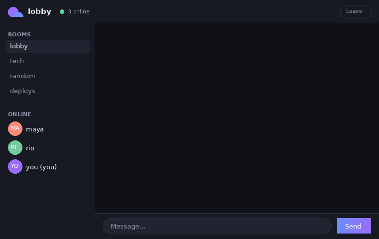

<p align="center">
  
</p>

<p align="center">
  
  
  
  
</p>

<p align="center">
  
</p>

Pick a nickname, join a room, talk. **banter** is a real-time public chat
app — no accounts, no database, no build step. Users and rooms live in
server memory, so a restart wipes everything and nothing about you is
ever stored.

## Quick start

```bash
git clone https://github.com/navairgap/banter.git
cd banter
npm install
npm start
```

Open **http://localhost:3000** in as many tabs as you like — each tab is
another person in the room.

Requires Node.js 18+.

## Features

- 💬 **Multiple public rooms** — lobby, tech, random… or create your own
  with one click
- 👀 **Live online list** per room, with join/leave notices
- ✍️ **Typing indicators** — animated, with names
- 🎨 **Duplicate nicknames handled** — two "alex" become `alex` and `alex (2)`
- 📱 **Responsive** — sidebar collapses into a slide-in overlay on mobile
- 🔔 **Unread counter** in the tab title when the window is hidden
- 🔌 **Connection-aware** — status dot, input locks when disconnected
- 🛡️ **XSS-proof by construction** — the client renders everything with
  `textContent`; user input can never inject markup

## How it works

```
Browser (js/app.js) --socket.io--> server.js --broadcast--> room members
```

| Event     | Direction | Payload                  | Purpose              |
|-----------|-----------|--------------------------|----------------------|
| `join`    | client →  | `{ name, room }`         | join / switch room   |
| `message` | client →  | `text`                   | send a message       |
| `typing`  | client →  | `bool`                   | typing indicator     |
| `new room`| client →  | `room`                   | create a room        |
| `message` | → client  | `{ user, text, time }`   | incoming message     |
| `system`  | → client  | `{ text, time }`         | join/leave notices   |
| `users`   | → client  | `string[]`               | room's online list   |
| `rooms`   | → client  | `string[]`               | all rooms            |
| `typing`  | → client  | `{ user, isTyping }`     | who's typing         |

Limits: nicknames 20 chars, messages 500 chars (over-limit is rejected,
not truncated), rooms 24 chars. Everything is trimmed and validated
server-side.

## Testing

```bash
npm test
```

Boots the server on a scratch port, connects two real socket clients, and
verifies joining, duplicate names, user lists, messaging, length limits,
typing events, room creation, and disconnect cleanup.

## Deploying

Listens on `process.env.PORT` (default 3000), no build step, no external
services:

- **Render / Railway / Fly.io** — start command `npm start`
- **VPS** — `npm install && pm2 start server.js --name banter`
- **Heroku-family** — `web: npm start` in a Procfile

## Project layout

```
server.js        Express + Socket.IO backend, in-memory state
index.html       join screen + chat screen markup
styles/main.css  dark theme, animations, responsive layout
js/app.js        client: rendering, socket events, typing, unread badge
test/smoke.js    two-client integration test
docs/            banner + demo animation for this README
```

## Honest limits

- In-memory only — restarting the server empties rooms and user lists
- No message history — everything is relayed live, nothing is stored
- Demo-grade moderation — no rate limiting or auth; add them before
  exposing it to strangers

## License

MIT, see [LICENSE](LICENSE).
